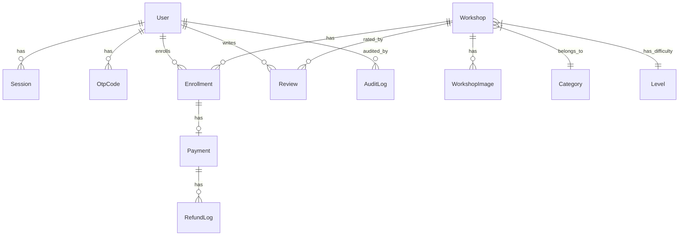

# Database Schema

## Entity-Relationship Diagram

## Tables

### users
| Column | Type | Notes |
|--------|------|-------|
| id | UUID | PK |
| email | CITEXT | Unique, case-insensitive |
| name | TEXT | Display name |
| password_hash | TEXT | Nullable (OAuth users) |
| phone | TEXT | Optional |
| picture_url | TEXT | Optional |
| age | SMALLINT | Optional |
| address | TEXT | Optional |
| role | user_role | Enum: student, instructor, admin, super_admin |
| status | user_status | Enum: active, inactive, blocked |
| is_verified | BOOLEAN | Email verified? |
| expertise | TEXT | Instructor only |
| bio | TEXT | |
| created_at | TIMESTAMPTZ | |
| updated_at | TIMESTAMPTZ | |

### sessions
| Column | Type | Notes |
|--------|------|-------|
| id | UUID | PK |
| user_id | UUID | FK -> users(id) |
| token_hash | TEXT | SHA-256 of session token |
| expires_at | TIMESTAMPTZ | |
| created_at | TIMESTAMPTZ | |

### otp_codes
| Column | Type | Notes |
|--------|------|-------|
| email | CITEXT | PK, FK -> users(email) |
| code_hash | TEXT | SHA-256 of OTP code |
| attempts | INT | Max 5 |
| expires_at | TIMESTAMPTZ | 10-min TTL |
| created_at | TIMESTAMPTZ | |

### categories
| Column | Type | Notes |
|--------|------|-------|
| id | UUID | PK |
| name | TEXT | |
| slug | TEXT | Unique |
| description | TEXT | Optional |
| thumbnail_url | TEXT | Optional |
| created_at | TIMESTAMPTZ | |
| updated_at | TIMESTAMPTZ | |

### levels
| Column | Type | Notes |
|--------|------|-------|
| id | UUID | PK |
| name | TEXT | e.g. Beginner, Intermediate |
| created_at | TIMESTAMPTZ | |
| updated_at | TIMESTAMPTZ | |

### workshops
| Column | Type | Notes |
|--------|------|-------|
| id | UUID | PK |
| title | TEXT | |
| slug | TEXT | Unique |
| description | TEXT | Optional |
| location | TEXT | Optional |
| price_cents | BIGINT | 0 = free |
| start_date | TIMESTAMPTZ | Optional |
| end_date | TIMESTAMPTZ | Optional |
| max_seats | INT | Optional (NULL = unlimited) |
| current_enrollments | INT | Default 0 |
| min_age | SMALLINT | Optional |
| category_id | UUID | FK -> categories(id) |
| level_id | UUID | FK -> levels(id) |
| created_by | UUID | FK -> users(id) |
| created_at | TIMESTAMPTZ | |
| updated_at | TIMESTAMPTZ | |

### workshop_images
| Column | Type | Notes |
|--------|------|-------|
| id | UUID | PK |
| workshop_id | UUID | FK -> workshops(id) |
| url | TEXT | Public URL |
| s3_key | TEXT | S3/MinIO object key |
| created_at | TIMESTAMPTZ | |

### enrollments
| Column | Type | Notes |
|--------|------|-------|
| id | UUID | PK |
| user_id | UUID | FK -> users(id) |
| workshop_id | UUID | FK -> workshops(id) |
| status | enrollment_status | Enum: pending, complete, cancelled, failed |
| enrolled_at | TIMESTAMPTZ | |
| updated_at | TIMESTAMPTZ | |
| cancelled_at | TIMESTAMPTZ | Nullable |

### payments
| Column | Type | Notes |
|--------|------|-------|
| id | UUID | PK |
| enrollment_id | UUID | FK -> enrollments(id), Unique |
| amount_cents | BIGINT | |
| currency | TEXT | e.g. BDT, USD |
| status | payment_status | Enum: unpaid, paid, failed, cancelled, refunded |
| transaction_id | TEXT | SSLCommerix transaction ID |
| gateway_data | JSONB | Raw gateway response |
| paid_at | TIMESTAMPTZ | Nullable |
| created_at | TIMESTAMPTZ | |
| updated_at | TIMESTAMPTZ | |

### reviews
| Column | Type | Notes |
|--------|------|-------|
| id | UUID | PK |
| user_id | UUID | FK -> users(id) |
| workshop_id | UUID | FK -> workshops(id) |
| rating | SMALLINT | 1-5 |
| title | TEXT | Optional |
| body | TEXT | |
| status | review_status | Enum: pending, approved, rejected |
| moderated_by | UUID | FK -> users(id), Nullable |
| moderated_at | TIMESTAMPTZ | Nullable |
| created_at | TIMESTAMPTZ | |
| updated_at | TIMESTAMPTZ | |

### contacts
| Column | Type | Notes |
|--------|------|-------|
| id | UUID | PK |
| name | TEXT | |
| email | CITEXT | |
| subject | TEXT | |
| message | TEXT | |
| is_read | BOOLEAN | |
| created_at | TIMESTAMPTZ | |

### audit_logs
| Column | Type | Notes |
|--------|------|-------|
| id | BIGSERIAL | PK |
| occurred_at | TIMESTAMPTZ | |
| event_type | TEXT | e.g. user.registered |
| aggregate_type | TEXT | e.g. User |
| aggregate_id | UUID | |
| actor_id | UUID | FK -> users(id), Nullable |
| changes | JSONB | |
| ip_address | INET | Nullable |
| user_agent | TEXT | Nullable |

### jobs
| Column | Type | Notes |
|--------|------|-------|
| id | BIGSERIAL | PK |
| job_type | TEXT | |
| payload | JSONB | |
| status | job_status | Enum: pending, running, done, failed |
| max_retries | INT | |
| retry_count | INT | |
| scheduled_at | TIMESTAMPTZ | |
| started_at | TIMESTAMPTZ | Nullable |
| completed_at | TIMESTAMPTZ | Nullable |
| error | TEXT | Nullable |
| created_at | TIMESTAMPTZ | |
